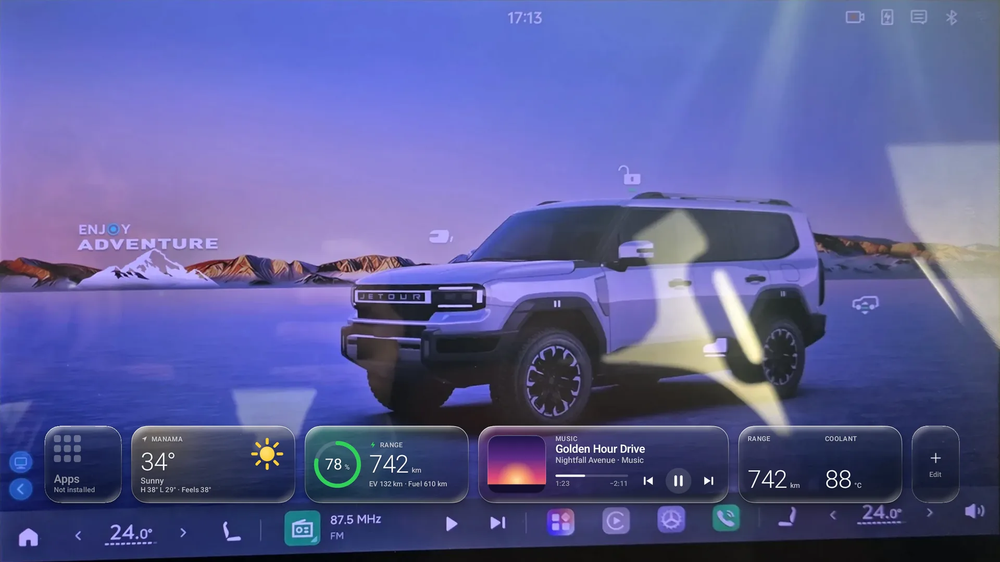
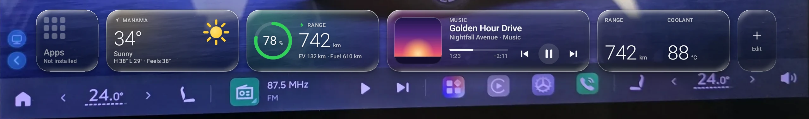

# G700 Home

Liquid Glass widgets for the **Jetour G700** home screen. G700 Home draws a
single horizontal strip of glass cards (weather, energy, now playing, vehicle
figures, tyres, a clock and app shortcuts) on the car's centre screen
(display 0). The strip sits above the dock and below the vendor's 3D car. It
decorates the car's home screen and does not replace it. It also works
alongside the DisplayMirror app launcher and the HELM overlay launcher.

- **Package:** `com.g700.home` (debug builds: `com.g700.home.debug`)
- **Website:** [home.g700.mahmoodmajeed.com](https://home.g700.mahmoodmajeed.com) has the download and the setup guide, in English and Arabic.
- **Releases:** [github.com/mahmoodmajeed/G700-Home/releases](https://github.com/mahmoodmajeed/G700-Home/releases)
- **Developer:** Developed by Mahmood Majeed · Bahrain · [mahmoodmajeed.com](https://mahmoodmajeed.com) · Telegram [@MahmoodMajeed](https://t.me/MahmoodMajeed)

---

## Screenshots

| Overview | Widgets |
|---|---|
|  |  |
| **Appearance** | **Placement** |
|  |  |

_Rendered at the car's resolution (2560 × 1440, density 1.5) on the emulator, with demo data and a photo of the car's home screen behind the strip. Shots from the car will replace them._

## What it does

**The strip.** By default it shows only on the car's home screen. It steps
aside for everything else: other apps, the notification shade, dialogs, the
keyboard, and an overlay launcher's panel. It hides while the screen is off.
It sits 12 dp above the dock, and its first card lines up with the dock's
first icon (a 76 dp edge margin). Both distances are adjustable.

| Action | Result |
|---|---|
| Tap a card | It does its one job: play/pause, open the player, refresh the weather, open the app grid, launch an app. |
| Long-press a card | Opens that widget's settings in the manager. |
| Tap the edit tile (+) | Opens the widget library in the manager. |

**The widgets.** Cards are 132 dp tall. Their widths are S 132, M 280,
L 428 and XL 576 dp, with a 16 dp gap between cards.

| Widget | Sizes | What it shows |
|---|---|---|
| Clock | S, M | The time, with optional date and seconds. It follows the system's 12/24-hour setting unless you choose one. |
| Weather | S, M, L | Temperature, condition and feels-like, for your location or a fixed city. The L size adds an hourly or daily forecast. |
| Energy | S, M, L | Battery level as a ring, a capsule bar like the cluster's, or plain figures. Shows EV range (WLTC or CLTC) and, optionally, fuel. |
| Vehicle | S, M, L | Up to two figures per column (six at most). You pick from: total range, EV range, fuel range, battery %, fuel %, coolant, outside and cabin temperature, 12 V battery, odometer, average energy, average fuel, hybrid mode and charge time left. |
| Tyres | S, M | Four tyre pressures in kPa, bar or psi, with optional temperatures. |
| Now Playing | M, L, XL | Title, artist, artwork and progress, with previous, play/pause and next buttons. It can show always, only while something plays, or hide after 2, 5, 10 or 30 idle minutes. |
| Apps | S | Opens DisplayMirror's app grid. G700 Home has no app drawer of its own. |
| Shortcut | S, M | One app of your choice, one tap away. |

The default layout is Apps (S), Weather (M), Energy (M), Now Playing (L) and
Vehicle (M), plus the edit tile. It fits the 1706 dp-wide screen. There is no
clock by default because the status bar already shows the time.

**The manager.** Open it from the app grid, or tap the strip's edit tile.

- **Overview:** whether the strip is showing right now and why, plus the one-tap setup and its permission checklist.
- **Widgets:** add, remove, reorder, resize and configure cards.
- **Appearance:** glass clarity (Clear, Balanced, Frosted, Solid), edge light, accent colour, glow, strip size (Compact, Standard, Large, Extra large) and reduce motion.
- **Placement:** alignment (start, centre, end), edge margin and lift above the dock. While this page is open, the real strip shows live.
- **About:** the version, a one-tap update from GitHub, and credits.

Visibility settings choose between home screen only and everywhere. They also
cover per-app "Also show on" and "Never show on" lists, stepping aside for panels, and the
edit tile. [docs/SETUP.md](docs/SETUP.md) explains every reason the strip can
be hidden.

## Requirements

- A **Jetour G700** with the stock head unit: Android 14 (API 34), with display 0 at 2560 × 1440. The minSdk is 30, but the app is built and tuned for this car only.
- No root, no PC and no account.
- Optional: the **DisplayMirror** launcher (`com.example.displaymirror`). The Apps card opens it. Without it, use Shortcut cards.
- Optional: an internet connection, used only for the weather, place search and update checks. The strip and the car data work offline.

## Install

1. On the car, open a browser (for example Firefox or Downloader) and go to
   **home.g700.mahmoodmajeed.com**. The short link
   **home.g700.mahmoodmajeed.com/download** always starts the latest APK.
2. Open the downloaded `G700Home-v<version>-release.apk` and tap **Install**.
   Allow installing from the browser if Android asks.
3. Open **G700 Home**, either from the installer's **Open** button or from
   DisplayMirror's app grid. If it isn't there yet, scroll to the end of the
   list to refresh it.

After that the app keeps itself current. Whenever you open the manager it
checks GitHub for a newer release, which then installs in one tap.

## Setup

On the **Overview** page, run the **one-tap setup**. G700 Home connects to the
head unit's own ADB daemon over the local loopback, with no PC and no cable,
and in one session it:

- switches on its accessibility service, leaving every other enabled service as it was;
- allows notification access, which is used only to see media sessions;
- grants location (including background) and notifications;
- allows "draw over other apps" (the fallback window) and "install unknown apps" (for self-updates).

If DisplayMirror was provisioned on the car, G700 Home reuses its
already-trusted ADB key and nothing is asked. Otherwise the car shows
**"Allow USB debugging?"** on the main screen once: tick **Always allow**, tap
**Allow**, then run the setup again. From then on
the app holds `WRITE_SECURE_SETTINGS` and switches its accessibility service
back on by itself at boot.

Every grant is optional. [docs/SETUP.md](docs/SETUP.md) covers manual setup,
what each grant does, and troubleshooting.

## Privacy

- **Nothing to sign up for:** no account, no sign-in, no analytics, no ads, no tracking.
- **The network is used for three things only:**
  - weather, from [Open-Meteo](https://open-meteo.com);
  - place search and place names, from Open-Meteo geocoding and OpenStreetMap's Nominatim;
  - update checks and downloads, from GitHub.
- **Location** is used for the weather only. One last fix is kept on the head unit for offline use.
- **Car data is read-only** and never leaves the head unit. The app never writes a vehicle setting.
- **Notification access** exists only because Android requires it to list media sessions. The app never reads a notification.
- **The accessibility service** reads only each window's type, bounds and owning package. It never reads screen text and never performs actions.

## Documentation

- [docs/SETUP.md](docs/SETUP.md): setup on the car, what each permission does, and troubleshooting keyed to each reason the strip can be hidden.
- [home.g700.mahmoodmajeed.com](https://home.g700.mahmoodmajeed.com): download, features and setup, in English and Arabic.

Releases are built from a private source repository and signed with the
developer's release key (certificate SHA-256 `36ae81b9…724f`), the same key as
the G700 Rear Screens Launcher.

## Credits and attribution

- Weather data by [Open-Meteo.com](https://open-meteo.com), licensed [CC BY 4.0](https://creativecommons.org/licenses/by/4.0/). Place search also uses Open-Meteo's geocoding API.
- Place names from [Nominatim](https://nominatim.openstreetmap.org): © [OpenStreetMap contributors](https://www.openstreetmap.org/copyright).
- The one-tap ADB setup is ported from the G700 Rear Screens Launcher. The motion tokens and the measured bar heights come from HELM.
- The look is inspired by Apple's Liquid Glass. It is an independent implementation that uses no Apple assets or fonts.

---

An independent community project, not affiliated with Jetour or the vehicle
manufacturer. Car data is only ever read, never written.
