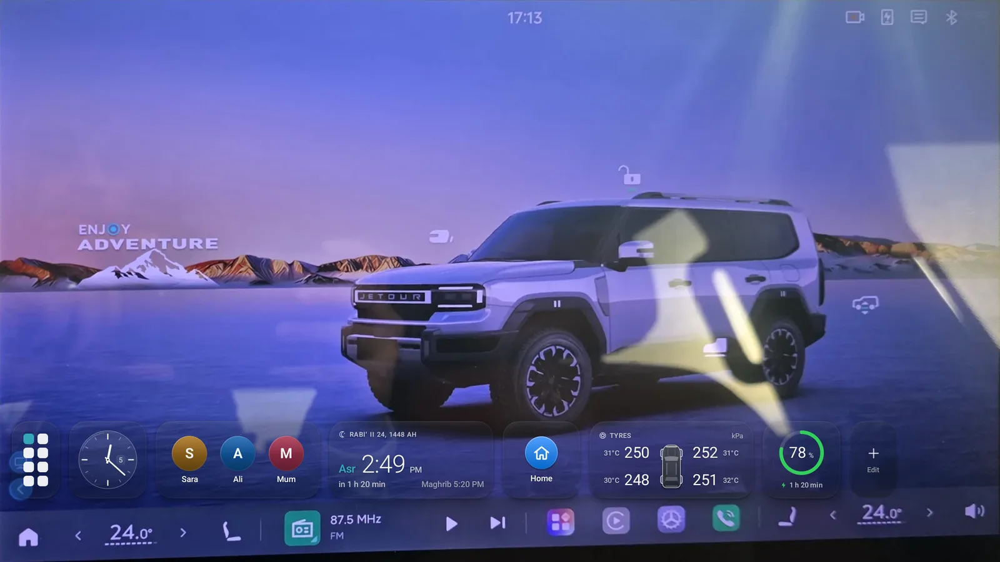
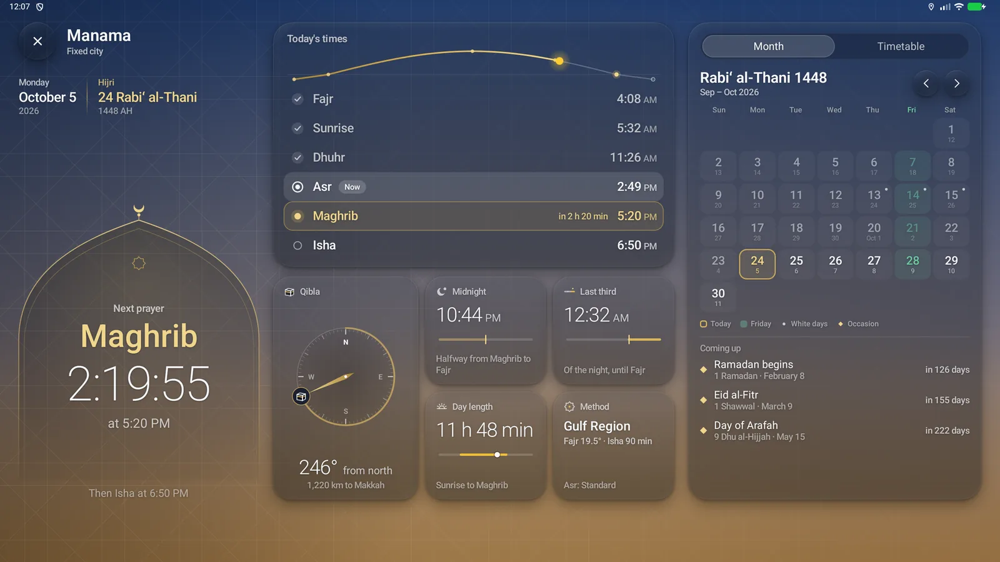
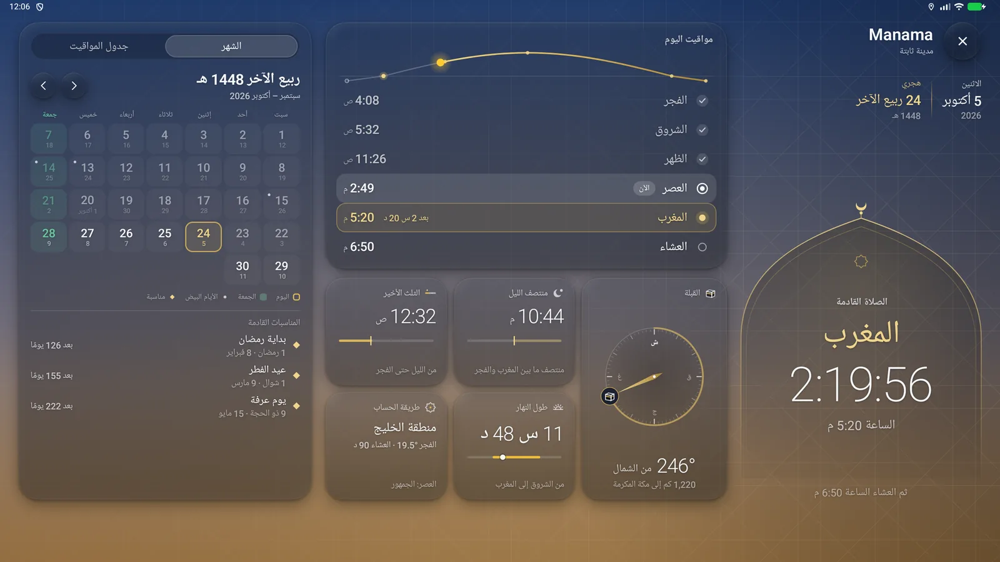
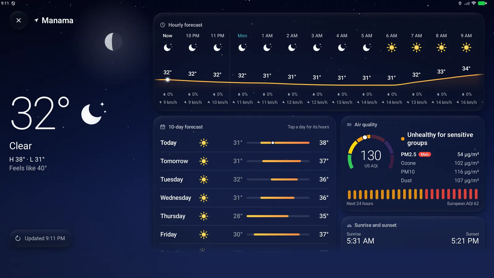
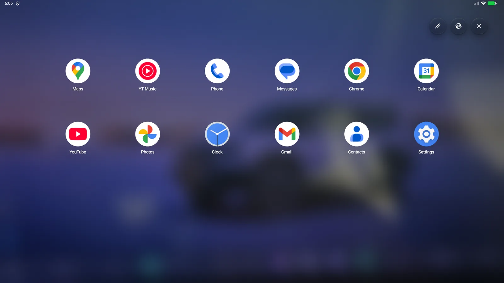
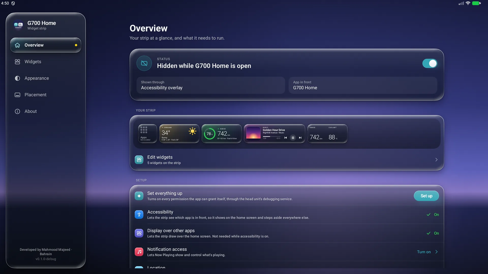
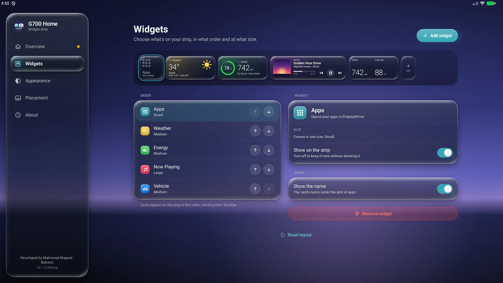
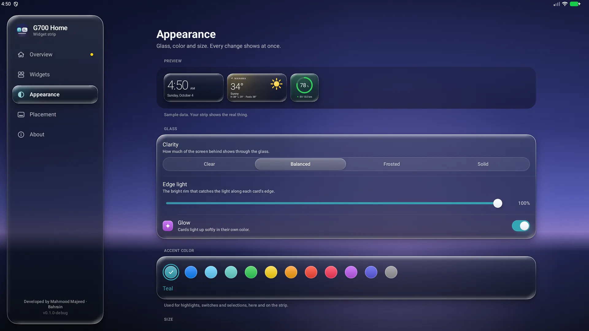
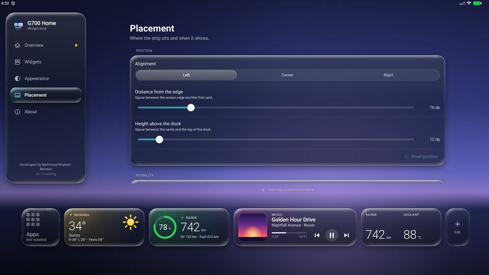

# G700 Home

Liquid Glass widgets for the **Jetour G700** home screen. G700 Home draws a
single horizontal strip of glass cards (weather, energy, now playing, vehicle
figures, tyres, a clock, app shortcuts, quick contacts, prayer times and
navigation) on the car's centre screen (display 0). The strip sits above the
dock and below the vendor's 3D car. It decorates the car's home screen and does
not replace it. It also works alongside the DisplayMirror app launcher and the
HELM overlay launcher.

- **Package:** `com.g700.home` (debug builds: `com.g700.home.debug`)
- **Website:** [home.g700.mahmoodmajeed.com](https://home.g700.mahmoodmajeed.com) has the download, the one-click installer and the setup guide, in English and Arabic.
- **Releases:** [github.com/mahmoodmajeed/G700-Home/releases](https://github.com/mahmoodmajeed/G700-Home/releases) ([latest](https://github.com/mahmoodmajeed/G700-Home/releases/latest))
- **Developer:** Developed by Mahmood Majeed · Bahrain · [mahmoodmajeed.com](https://mahmoodmajeed.com) · Telegram [@MahmoodMajeed](https://t.me/MahmoodMajeed)

---

## Screenshots

| Prayer times | In Arabic, right to left |
|---|---|
|  |  |
| **Full forecast** | **Favourites launcher** |
|  |  |
| **Overview** | **Widgets** |
|  |  |
| **Appearance** | **Placement** |
|  |  |

_Rendered at the car's resolution (2560 × 1440, density 1.5) with demo data. The strip is shown over a photo of the car's home screen. Shots from the car will replace them._

## What it does

**The strip.** By default it shows only on the car's home screen. It steps
aside for everything else: other apps, the notification shade, dialogs, the
keyboard, and an overlay launcher's panel. It hides while the screen is off.
It sits in the corner by default, 20 dp above the dock and 20 dp from the
screen's left edge. Both distances are adjustable.

| Action | Result |
|---|---|
| Tap a card | It does its one job: play/pause, open the player, open the full forecast, open the app grid or your favourites, launch an app, call a contact, start a route. |
| Long-press a card | Opens that widget's settings in the manager. An Apps card set to **App and favourites** (the default) opens your favourites launcher instead. |
| Tap the edit tile (+) | Opens the widget library in the manager. |
| Swipe up on the cards | Opens **Recent apps** (see below). |

**The widgets.** Cards are 132 dp tall. Their widths are S 132, M 280,
L 428 and XL 576 dp, with a 16 dp gap between cards.

| Widget | Sizes | What it shows |
|---|---|---|
| Clock | S, M | Digital or analogue. The time, with optional date and seconds (on the small digital clock the seconds show small, under the time). It follows the system's 12/24-hour setting unless you choose one. |
| Weather | S, M, L | Temperature, condition and feels-like, for the car's location or a fixed city. The L size adds an hourly or daily forecast. It opens at once on the car's last known place, then follows GPS; a fallback city covers a long wait. Tap it for a full-screen forecast: hours, ten days, air quality and dust, UV, wind, sun and moon. |
| Energy | S, M, L | Battery level as a ring, a capsule bar like the cluster's, or plain figures, with fuel % and the charging state. (No range in km: the car often leaves it empty. A Vehicle card can still show EV range when the car reports it.) |
| Vehicle | S, M, L | Up to two figures per column (six at most). You pick from: total range, EV range, fuel range, battery %, fuel %, coolant, outside and cabin temperature, 12 V battery, odometer, average energy, average fuel, hybrid mode and charge time left. |
| Tyres | S, M | Four tyre pressures in kPa, bar or psi, with temperatures when the car reports them. A low tyre is marked in a high-contrast warning colour. |
| Now Playing | M, L, XL | Title, artist, artwork and progress, with previous, play/pause and next buttons. It can show always, only while something plays, or hide after 2, 5, 10 or 30 idle minutes. |
| Apps | S | Icon only by default (a small mark of upright two-column tiles), on a slim card as narrow as the edit tile. A tap opens DisplayMirror's app grid (or an app you choose) and a long press opens your favourites launcher. It can also open just one of them, swap tap and long press, and show its name on a square card. |
| Shortcut | S, M | One app of your choice, one tap away. |
| Quick contacts | S, M, L, XL | Up to six people as round avatars. A tap calls straight away over the car's Bluetooth phone. Pick them from the phonebook the phone shares with the car, or type a number. Their photos are kept in the app, so they stay after restarts and drives. |
| Prayer times | S, M, L | The next prayer and the time left, for where the car is (or a fixed city). The L size shows all six times. Calculated offline, with a choice of method and Asr, and an optional Hijri date. Tap it for the full screen: today's times on the sun's path with a countdown to the next, the Qibla, the night's middle and last third, and the Hijri month or a 30-day timetable. In Ramadan it adds Imsak and Iftar. The Hijri date can move a day or two for a local moon sighting, and each time can move up to 30 minutes or be hidden. The card also glows before a prayer (see **Prayer reminder** below). |
| Navigate | S, M | One tap starts the route to a saved place (Home, Work or any place) in Google Maps, Waze or the default map app. A rebuilt Google Maps (such as ReVanced) counts as Google Maps. |

The default layout is Apps (S), Weather (M), Energy (M), Now Playing (L) and
Vehicle (M), plus the edit tile. It fits the 1706 dp-wide screen. There is no
clock by default because the status bar already shows the time.

**Recent apps.** The head unit has no recent-apps screen, so G700 Home adds
one. Swipe up from the middle of the bottom edge, swipe up on the strip, or tap
the button in the favourites launcher. The apps used in the last 12 hours show
as a carousel of glass cards, most recent first. Tap a card to switch back to
that app, or swipe it up to close it. Closing ends only what Android lets an
ordinary app end, and nothing is force-stopped. It needs **Usage access**,
which tells the app when each app was last open and nothing else. The one-tap
setup allows it, and the app quietly allows it again if it is lost. While an
app is full screen (it hides the status bar and the dock, like a video), the
bottom-edge swipe steps aside so it can't be opened by mistake, and it comes
back with the bars.

**Back.** The head unit has no back key either. Turn on an **edge swipe**
(left, right or both edges, on the part of the edge you choose) or a small
**floating button** that you can hold to move and then lock. Either one goes
back in the app in front, exactly like a back key, and stays hidden on the
car's home screen. It is off by default and needs the accessibility service. The edge swipe pulls a
translucent liquid-glass bulge with a chevron that follows your finger. It
changes tint once letting go will go back, and sliding back to the edge cancels.
Over a full-screen app the edge swipe keeps working, and the floating button
turns almost clear so it doesn't cover the picture. It still works: a touch
lights it up again.

**Launcher folders.** Favourites stays the default. If you make folders, they
show as pills at the top of the launcher, and they scroll sideways when there
are many. The first button, **View all**, shows every folder as a grid of
tiles. Make, rename, reorder and delete folders, and pick their apps, in the
manager under **Launcher**, **Folders**, or tap the small **+** at the end of
the pills for a new one. Swipe past the last page of Favourites or a folder to
go on to the next one, and back past the first page for the one before. Since
0.7.0, Favourites is a set of starred apps rather than a folder: an app can be
in Favourites and in one folder at the same time. Deleting a folder moves its
apps that aren't already in Favourites to the end of Favourites.

**The app menu.** Press and hold an app in the launcher for **Open**, **Add to
Favourites** or **Remove from Favourites** (a star), **Move to folder**
(including **New folder…**), **Uninstall** (for apps you installed; Android
asks you to confirm) and **Permissions**. To edit the launcher, tap the
pencil button, or hold an icon and drag it.

**App permissions.** The **Permissions** item opens a screen that lists the
app's runtime permissions and special access, with a switch for each, and
**Grant all** (best effort, and it asks first). It works through the head
unit's own local debugging service, like the one-tap setup, so the first time
the car may ask **"Allow USB debugging?"**: tap **Allow** with **Always allow**
ticked. Nothing leaves the car, and it never uninstalls an app through adb.

**Prayer reminder.** The Prayer card glows softly in glass blue 20 minutes
before a prayer (set it from 5 to 60), and with a brighter icy glow at the
prayer time for 3 minutes (1 to 15). It is on by default. Change it in the
Prayer card's settings under **Reminder**.

**Setup that fixes itself.** Since 0.7.0 the app checks the permissions it
really needs (accessibility, usage access, notification access for Now
Playing, and "draw over other apps" when the strip uses that drawing method)
each time it starts and each time you open the manager. A missing one is turned
back on quietly, without any prompt, when the car already trusts the app. If
something still needs you, a banner on the manager says what is off and what
stops working, with **Fix** and **Later**, and a quiet notification says the
same. **Later** puts it off for six hours, or until the car is next started.

**The manager.** Open it from the app grid, or tap the strip's edit tile. Its
side menu scrolls when the text is large, and the highlight stays on the page
you are on.

- **Overview:** whether the strip is showing right now and why, plus the one-tap setup, its permission checklist and **Keep accessibility on**.
- **Widgets:** add, remove, reorder, resize and configure cards. The chosen card's settings are on the left, nearest the driver, and the list of cards is on the right.
- **Launcher:** the favourites launcher's apps, grid size (4–10 columns, 2–6 rows), icon size, labels and background, with a live preview. The launcher floats over the current app with a blur, and its dimming keeps names readable over a light or dark screen. **Folders** creates, renames, reorders and deletes folders and picks their apps. It has no title and no "Add apps" tile: tap the pen to edit, then **Add apps**.
- **Recent apps:** usage access (with **Set up**), the ways to open recent apps, and **Show closed apps again**.
- **Back:** off, edge swipe or floating button; which edges and where on them; lock or reset the button.
- **Appearance:** glass clarity (Clear, Balanced, Frosted, Solid), edge light, accent colour, glow, strip size (Compact, Standard, Large, Extra large) and reduce motion.
- **Placement:** alignment (start, centre, end), edge margin, lift above the dock and the drawing method. While this page is open, the real strip shows live.
- **About:** the version, a one-tap update from GitHub, the quick tour, credits, and a collapsed **Troubleshooting details** section.

A short **quick tour** opens on first start (and once after updating to
0.3.0). It shows what the Apps card does, that the weather opens a full
forecast, how to change a card, and what's new.

Visibility settings choose between home screen only and everywhere. They also
cover per-app "Also show on" and "Never show on" lists, stepping aside for
panels, and the edit tile. [docs/SETUP.md](docs/SETUP.md) explains every reason
the strip can be hidden.

## Requirements

- A **Jetour G700** with the stock head unit: Android 14 (API 34), with display 0 at 2560 × 1440. The minSdk is 30, but the app is built and tuned for this car only.
- No root and no account. A computer is needed only for the optional one-click install.
- Optional: the **DisplayMirror** launcher (`com.example.displaymirror`). The Apps card opens it by default. Without it, point the Apps card at another app or at your favourites.
- Optional: a phone connected to the car over Bluetooth, for Quick contacts.
- Optional: Google Maps, Waze or another map app on the head unit, for Navigate.
- Optional: an internet connection, used only for the weather, place search and update checks. The strip, the car data and prayer times work offline.

## Install

**From a computer, in one click (recommended).** Turn on ADB in the car's
engineering menu. Connect the car's upper USB-A port on the driver's side to a
computer with a USB-A to USB-A **data** cable. Then open
**[home.g700.mahmoodmajeed.com/install](https://home.g700.mahmoodmajeed.com/install)**
in Chrome or Edge and press the button. Pick the car in the browser's list,
then tap **Allow** on the car's screen. The page installs the latest release and
turns on every permission listed under Setup, so there is nothing else to do.
Close other ADB tools (Android Studio, `adb`) first, because only one program
can talk to the car at a time. [docs/SETUP.md](docs/SETUP.md) has the steps in
full.

**On the car itself.**

1. On the car, open a browser (for example Firefox or Downloader) and go to
   **home.g700.mahmoodmajeed.com**. The short link
   **home.g700.mahmoodmajeed.com/download** always starts the latest APK.
2. Open the downloaded `G700Home-v<version>-release.apk` and tap **Install**.
   Allow installing from the browser if Android asks.
3. Open **G700 Home**, either from the installer's **Open** button or from
   DisplayMirror's app grid. If it isn't there yet, scroll to the end of the
   list to refresh it. Then run the one-tap setup (below).

After that the app keeps itself current. Whenever you open the manager it
checks GitHub for a newer release, which then installs in one tap.

## Setup

On the **Overview** page, run the **one-tap setup**. G700 Home connects to the
head unit's own ADB daemon over the local loopback, with no PC and no cable,
and in one session it:

- switches on its accessibility service, leaving every other enabled service as it was;
- allows notification access, which is used only to see media sessions;
- grants location (including background) and notifications;
- grants phone calls and contacts, for the Quick contacts widget;
- allows "draw over other apps" (the window the strip is drawn in by default) and "install unknown apps" (for self-updates);
- allows **Usage access**, which Recent apps needs.

If DisplayMirror was provisioned on the car, G700 Home reuses its
already-trusted ADB key and nothing is asked. Otherwise the car shows
**"Allow USB debugging?"** on the main screen once: tick **Always allow**, tap
**Allow**, then run the setup again. From then on the app holds
`WRITE_SECURE_SETTINGS` and switches its accessibility service back on by
itself at boot. If another app later switches it off, **Keep accessibility on**
(on Overview, on by default) puts it straight back, and leaves that app's own
services on.

Since 0.7.0 the one-tap setup runs by itself the first time you open the
manager, after the welcome and the quick tour (also once after updating), so on
most cars there is nothing to press.

If a permission the app needs is ever lost, it quietly turns it back on, so
**Recent apps**, **Back** and **Now Playing** keep working. If it can't, the
manager shows a banner with **Fix**. The **Recent apps** page also offers **Set
up**. **Back** is off until you choose a style on the **Back** page.

**Updating from 0.2.x?** Run the one-tap setup once more. Overview shows the
setup as not finished until you do, because Quick contacts needs phone access.

Only the grants the banner asks for are needed for what you use; the rest are
optional. [docs/SETUP.md](docs/SETUP.md) covers manual setup,
what each grant does, and troubleshooting.

## Privacy

- **Nothing to sign up for:** no account, no sign-in, no analytics, no ads, no tracking.
- **The network is used for three things only:**
  - weather, the forecast and air quality, from [Open-Meteo](https://open-meteo.com);
  - place search and place names, from Open-Meteo geocoding and OpenStreetMap's Nominatim (the built-in city list works offline);
  - update checks and downloads, from GitHub.
- **Contacts** stay on the head unit. The phonebook is read only when you pick people for the Quick contacts card, and only the names, numbers and photos you choose are kept, in the app's own settings and storage.
- **Location** is used for the weather, prayer times and saving a Navigate place. The car's last position is kept on the head unit, so the weather can open on it before GPS answers. It leaves the head unit only as the coordinates of the weather and place-name requests above, and it is logged no finer than about 1 km.
- **Car data is read-only** and never leaves the head unit. The app never writes a vehicle setting. For the same reason there is no climate (A/C) control.
- **Notification access** exists only because Android requires it to list media sessions. The app never reads a notification.
- **The accessibility service** reads only each window's type, bounds and owning package. It never reads screen text. The only action it performs is going back, when you turn **Back** on.
- **Usage access** is read only for when each app was last open, to list recent apps. It stays on the head unit.
- **App permissions** changes another app's permissions through the head unit's own local debugging service. Nothing leaves the car, G700 Home never uninstalls an app through adb, and it never changes a car setting.

## Documentation

- [docs/SETUP.md](docs/SETUP.md): install, setup on the car, what each permission does, and troubleshooting keyed to each reason the strip can be hidden.
- [home.g700.mahmoodmajeed.com](https://home.g700.mahmoodmajeed.com): download, the one-click installer, features and setup, in English and Arabic.

Releases are built from a private source repository and signed with the
developer's release key (certificate SHA-256 `36ae81b9…724f`), the same key as
the G700 Rear Screens Launcher.

## Credits and attribution

- Weather data by [Open-Meteo.com](https://open-meteo.com), licensed [CC BY 4.0](https://creativecommons.org/licenses/by/4.0/). Place search also uses Open-Meteo's geocoding API.
- Place names from [Nominatim](https://nominatim.openstreetmap.org): © [OpenStreetMap contributors](https://www.openstreetmap.org/copyright).
- The one-tap ADB setup is ported from the G700 Rear Screens Launcher. The motion tokens and the measured bar heights come from HELM.
- The look is inspired by Apple's Liquid Glass. It is an independent implementation that uses no Apple assets or fonts.

---

An independent community project, not affiliated with Jetour or the vehicle
manufacturer. Car data is only ever read, never written.
